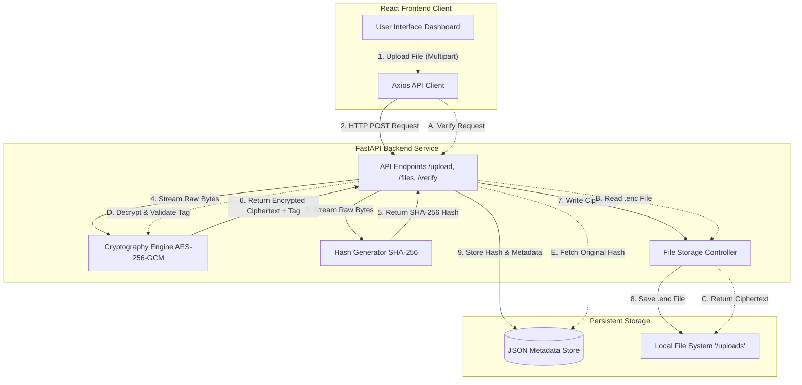

# System Architecture / Design

## 5. System Architecture and Design

### Overview
The Secure File Upload System operates on a decentralized client-server model designed to securely transmit, process, encrypt, and store data. It leverages a straightforward, asynchronous Request/Response architecture over HTTP. The React frontend provides a seamless graphical interface for the user, communicating through Axios with the FastAPI backend. All computationally intensive security operations (hashing, encryption, tag validation) occur entirely within the trusted backend server environment, ensuring that no keys or metadata are unnecessarily exposed to the client.

### Block Diagram

### System Components
1. **Frontend Interface (React / Vite)**: The presentation layer. It captures file inputs from the user, implements drag-and-drop functionality, and renders response alerts (hashes, file sizes, and verification markers) using a dynamic glassmorphism design.
2. **API Router (FastAPI)**: The central orchestrator. It handles incoming HTTP multiparts, manages asynchronous file reading, and coordinates between the hashing, encryption, and storage mechanisms.
3. **Cryptography Engine (Python `cryptography`)**: Dedicated to executing the AES-256 in Galois/Counter Mode. This module transparently handles internal IV/nonce creation, symmetric key loading from standard configurations, and encryption/decryption routines.
4. **Hash Generator (Python `hashlib`)**: Computes non-reversable mathematical checksums (SHA-256) based strictly on raw file byte arrays.
5. **Data Layer (JSON Store & Filesystem)**:
   - **JSON Metadata**: A persistent record mapping filenames to their expected SHA-256 hash footprints and metadata (like upload time).
   - **Ciphertext Storage**: The secure local directory where encrypted blobs are written to disk.

### Data Flow

#### File Upload Flow
1. **Initiation**: The user selects a file in the React UI, which bundles the file into a `multipart/form-data` payload and uses Axios to POST it to the backend `/upload` route.
2. **Processing**: FastAPI instantly receives the payload and reads the raw file bytes into memory. 
3. **Hashing & Encryption**: Simultaneously, the bytes are routed through the `hashing.py` module to generate a SHA-256 checksum and piped to `encryption.py` to produce secure ciphertext authenticated by GCM tags.
4. **Storage**: The encrypted blob is committed to the local filesystem (`/uploads`), while the plaintext filename and hash are securely lodged in the JSON metadata database.

#### Integrity Verification Flow
1. **Request**: The user triggers an integrity check, prompting the frontend to send a GET request via the `/verify/{filename}` route.
2. **Retrieval**: The backend router consults the JSON database for the file's expected SHA-256 hash and metadata footprint.
3. **Decryption and Tag Checking**: The encrypted file is read from the local disk. The cryptography module attempts to decrypt it. Crucially, if the file was maliciously tampered with (even a single byte flip), the GCM authentication tag validation fails immediately.
4. **Final Hash Comparison**: If the decryption tag passes, the plaintext bytes are returned to the hashing module to recompute their SHA-256 digest. This new digest is strictly compared against the database’s original footprint. If they perfectly match, the integrity is mathematically proven and the API issues a success response.
